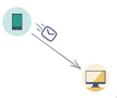
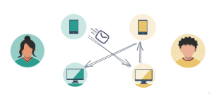
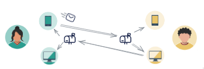
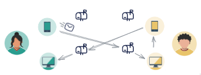
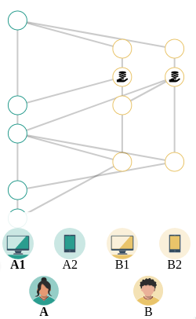
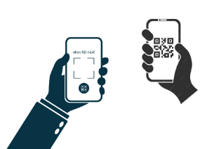
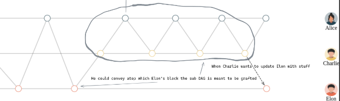
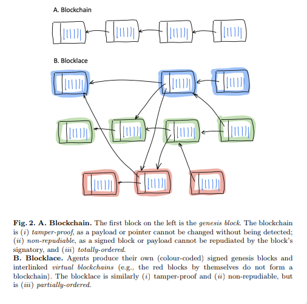
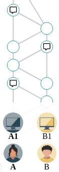

# Table of Contents

1.  [Local-First p2p Collaboration with KERI](#org70d9f12)
    1.  [Problems & Approaches](#orgee2261f)
        1.  [Who's talking?](#orge655de5)
        2.  [How do they talk?](#orgebdf819)
        3.  [What they're saying?](#org81a1ccf)
    2.  [Inspirations](#orgaa01d10)
    3.  [Components](#org1c91063)
        1.  [Device AID](#org6c4434e)
        2.  [AID<->AID connection](#orgd101841)
        3.  [Communication](#orgcf5baca)
        4.  [Interaction](#org64e994f)
        5.  [Group formation](#org43e56ca)
    4.  [Related](#org6ce2cb6)

# Local-First p2p Collaboration with KERI

## Problems & Approaches

[an example interaction](https://andrewzhurov.github.io/hashgraph/)

### Who's talking?

People, jeez.  

`>` It's meant to be an electronic message.  
Umm, people can't do that with electronic ones?

`>` No cybors walking around, last time I checked.  

1.  Fine, devices talking it is then.

    
    
    `>` Well, a device there does talk on somebody's behalf, right?  
    
    1.  Right, there's some AID, say an Alice AID, and she talks from her phone.
    
        
        
        `>` Do you have just one device in use?  
        
        1.  &#x2026; okay, multiple devices may be talking on behalf of an AID.
        
            
            
            `>` Is communication limited to Person<->Person? There are groups/assemblies, orgs, you know..  
            That's no prob., that AID may be a Group AID.  
            Well, you can treat a Personal AID as a Group AID, where Device AIDs are group members.

### How do they talk?

Device->Device E2EE message.  
Both are online, connected p2p.

`>` Does it mean we need to keep a p2p connection open per each communication?  
Sure, why not. Actually, per communication per device in that communication that would be.  
Computers can handle connections per 100+ of DM & group chats, say a 1000. Right? That would be fiiine.

`>` Doesn't p2p channel reveal the two ends talking?  
Well, you've got something to hide?

`>` Both devices need to be online in order to deliver a message?  
Umm, okay-okay, maybe we can do better..

1.  Would a mailbox make you happy?

      
    It won't be able to read your messages. They are E2EE.  
    Just pull them from your devices.
    
    `>` So what if it is faulty. I pulled from phone, it dropped the stored message and I can't pull it from my laptop now. How do devices sync?  
    Well, you could resend it to your personal mailbox.  
    
    `>` How would device know that I need to resend to another?  
    Ehh, say it does somehow.
    
    `>` And what if it's a Group's mailbox that has a 100 of members?  
    Would be a bit of overhead then.
    
    `>` If I want to send a message to my other device - do I send it to my personal mailbox?  
    That would be a way.
    
    `>` And now I need to keep the mailbox updated on who can pull those messages?  
    Yup.
    
    `>` But still, devices could talk to each other directly, p2p, say they're on the same wifi network?  
    That would be nice.
    
    `>` So it would be nice to exchange messages device-to-device?  
    
    1.  Yeah, right, perhaps we could keep it simple
    
        Mailbox per device then?  
          

### What they're saying?

The content is use-case specific, be it:  

-   Plain information exchange - e.g., a chat with receipts.
-   A CRDT - eventually consistent text document. Composition of personal takes.
-   Distributed ledger / State-Machine-Replication (SMR) / consensual replicated database.

However, causal metadata is use-case agnostic.  
In this sense, they gossip about gossip, building a Merkle-DAG of communication / Blocklace / Hashgraph.  
Simply capture what happens in a distributed system.  
Do whatever with it - Data FTW. (Unless it's too much of it)  
  

## Inspirations

[A Certain Tendency Of The Database Community](https://arxiv.org/pdf/1510.08473.pdf)  
[Grassroots Systems](https://arxiv.org/pdf/2301.04391)  
[A Grassroots Architecture to Supplant Global Digital Platforms by a Global Digital Democracy](https://arxiv.org/pdf/2404.13468)  

## Components

### Device AID

Handy for establishing device->device communication.  

### AID<->AID connection

A way for two AIDs to establish connection.  
[SPAC Relationship Formation](https://github.com/SmithSamuelM/Papers/blob/master/whitepapers/SPAC_Message.md#relationship-formation-protocol)  

1.  Options

    1.  Scan QR-code
    
        As in Telegram, WhatsApp, etc.  
          
    
    2.  Click on a connect invite link
    
        Of form `keri:connect-invite:<base64-encoded-invite>`.  
        Once clicked app opens with "Connect to X?".  
        You don't know whether it's really X on the other hand, the other side would need to provide you with its KEL, so you can establish that you talk to the correct signing keys.  
        You may already know (some of the) X's KEL, `X->sn` can be disclosed, so X knows to send its KEL's delta.  
    
    3.  Your friend introduces you to his friend
    
        I.e., your contact could issue to a contact of their a connect invite to you.  
        [TSP Third-party Relationship Referral](https://trustoverip.github.io/tswg-tsp-specification/#third-party-relationship-referral)  
        
        Say, A <-friends-> B <-friends-> C.  
        B could issue `connect-invite` for C to A.  
        
            {
             :connect-invite/to        <A-AID>
             :connect-invite/connector <B-AID>
             :connect-invite/from      <C-AID>
             }
        
        Have it anchored to B's KEL, disclosed to C, so C start DM with A, and A can accepts it since it's vouched by its friend B.  
    
    4.  FOAF
    
        One's contacts could be disclosed to another. E.g., disclose your friends to your friends.  
        Were A, B, C know of friendships among them, A could accept DM or friend request from C, as there's transitive trust A->B->C.  

2.  Expiry policy

    1.  One-shot
    
    2.  Time expiry
    
    3.  Until revoked
    
    4.  any combination of the above

### Communication

1.  Devices are the ones who do the talking

      
    I.e., ability for a controller to create and send message from a device within an AID<->AID communication.  
    E.g., Alice sends from her phone to Bob a text message, without the need to approve it from her laptop / collect enough sigs to satisfy threshold.  
    E.g., Alice sends from her phone to Bob a newly issued ACDC.  
    These messages have weaker authenticity, but they are handy for at least DM use-case and they can carry strongly authentic payload, such as an anchored ACDC or some threshold-signed data.  
    As mentioned in [KAGI](https://github.com/WebOfTrust/keripy/discussions/934), Two-Level KRAM.  

2.  Offline support

    While [direct p2p](https://docs.libp2p.io/concepts/nat/hole-punching/#hole-punching-in-libp2p) has its benefits, it comes with downsides too:  
    
    1.  No offline support.
    2.  Need to keep a channel open to learn updates, even if there's 1/month.
        E.g., a channel per DM.
    3.  Lessened privacy, talkings ends are known in public space.
    4.  It may not be possible, were both peers be behind symmetric NATs.
        As one's address = f(other's address).  
        Akin to content1 <-hash-link-> content2 problem.
    
    One should be able to send a message at any time, without the other being online, and another will learn of it when back online.  
    I.e., we need some sort of mailbox / intermediary.  
    Could be a mailbox per device of an AID.  
      
    
    1.  Ideally, without dependence on witnesses for communication
    
        As witnesses is an optional feature, and it seems out-of-scope for them. They're job is to back your KEL to protect you from duplicity.
    
    2.  Options
    
        [DIDComm](https://identity.foundation/didcomm-messaging/spec/v2.1/)  
        [Mailbox Director](https://github.com/WebOfTrust/keripy/blob/main/src/keri/app/indirecting.py#L455) [kourier](https://github.com/pfeairheller/kourier)  
        [SPAC Message](https://github.com/SmithSamuelM/Papers/blob/master/whitepapers/SPAC_Message.md) [TSP Routed Message](https://trustoverip.github.io/tswg-tsp-specification/#routed-messages-through-intermediaries)  

3.  DDOS protection

    Requires to form AID->AID relationships and routing context, as in SPAC, authorizing / whitelisting intermediary of another to your intermediary.  
    Given we have devices that exchange messages device->device, there would need to be Device AID -> Device AID relationship and routing context.  

4.  Keep it private

    I.e., 3rd-parties and 2nd-parties (mailboxes/intermediaries) do not know source and destination AIDs of a device->device message.  
    Can be achieved with [SPAC Triple-Level Nested Protocol](https://github.com/SmithSamuelM/Papers/blob/master/whitepapers/SPAC_Message.md#three-level-nested-protocol) or a DIDComm mailbox registered on did:peer of a new communication key.  

5.  N-wise/group communication

    Permissioned topics naturally allow for that. As seen in OrbitDB, Hashgraph.  
    
    1.  Gossip among members
    
        1.  Cordial Dissemination
        
              
            Where one tells another messages it knows that another needs and, to the best of one's knowledge, does not have.  
            This approach is also mentioned as the core of Battery-efficient gossip protocol in [Optimizing Gossiping for Asynchronous Fault-Prone IoT Networks With Memory and Battery Constraints](https://ieeexplore.ieee.org/stamp/stamp.jsp?tp=&arnumber=10379066).  
            
            1.  Could benefit from Simple KRAM to drop old messages
            
                Given any newer message is guaranteed to be more useful that an older one.  
                Makes communication not limited to ping-pong.  

### Interaction

I.e., Topic of a conversation, interaction context.  
Related: [SPAC Interaction Non-content Metadata](https://github.com/SmithSamuelM/Papers/blob/master/whitepapers/SPAC_Message.md#interaction-non-content-metadata).

1.  Events

    Member's contributions within a Topic are captured as Events.
    
    1.  Root Event
    
        The first event of an interaction, comes with Topic description, which at least includes communicating parties:  
        
        -   AIDs
        -   their last KE SAIDs
        -   "a way to reach me" / mailboxes
        
        And may include other interaction-specific info.
        I.e., some config.
        
        1.  Interaction ID ([IID](https://github.com/SmithSamuelM/Papers/blob/master/whitepapers/SPAC_Message.md#isaids-as-iids))
        
            Hash of the root Event.  
            Handy as a hint to a recipient of a message, so it is able to lookup the interaction it belongs to.  
    
    2.  Capture causal past
    
        Event comes with causal past baked in, as hashes to some prior events, e.g., forward extremities known by creator at the moment of creation.
        
        Affords us **protection from message drop, reorder and replay attacks**.  
        I.e., message is delivered with the exact causal past in which it's been created, and delivery is idempotent.  
        Hash-linking to prior events gives us that.
        
        1.  Options
        
            1.  [Blocklace](https://arxiv.org/abs/2402.08068)
            
                  
                Causal past makes it possible to devire  virtual blockchain / self-parent chain  of events from a creator.  
                This makes  forks / equivocations / duplicity  detectable.  
                However, this is based on assumption that key is not being compromised, i.e., forks created by the key holder.  
                KERI tought as that key compromise is one important atack vector to protect from, First-seen principle and Superseeding Recovery as good options.  
                In our context, it would mean that controller need to be able to point to the exact self-parent event he intends to issue a new event atop.  
                And that peers consider authorized fork as one that been signed with freshly unblinded pre-rotated keys.  
                To that end, we better of with  
            
            2.  [Hashgraph](https://www.swirlds.com/downloads/SWIRLDS-TR-2016-01.pdf)
            
                  
                Each event has at most 2 parents, self-parent and other-parent.  
                Where self-parent points to your last event, and other-parent points to an event you just received.  
                Root event has none parents.  
                This simply captures what happened in a given interaction.  
        
        2.  Some other art
        
            Matrix Event Graph ([causal past is added by homeserver](https://github.com/matrix-org/matrix-spec-proposals/pull/4080#discussion_r1398198284))  
            [Making CRDTs Byzantine Fault Tolerant](https://martin.kleppmann.com/papers/bft-crdt-papoc22.pdf)  
    
    3.  Authenticity of events
    
        Event comes signed or anchored.  
        Interestingly, authenticating the last event of a self-parent chain authenticates the whole sp-chain below it.  
        
        Anchoring would bloat KELs dramatically. And is rather meaningless for an ongoing interaction.  
        Can be useful when leaving it, to anchor the last event produced. Thus making authenticity of your contributions ever-green.  
        
        Signing, on the other hand, is handy when it's ongoing.  
        It plays well with the need to Tell Your Friends Your Novel Key Events, more on which later,  
        as this can be done in one go - issue an event with novel KE SAID & sign it with freshly unblinded key.  

2.  Interaction as Replicated Database

    Management of permitted participants would benefit from being synced across current participants.  
    One approach to have it is treat Merkle-DAG of events as a replicated database. Akin to OrbitDB.  
    
    [Merkle-CRDTs: Merkle-DAGs meet CRDTs](https://arxiv.org/abs/2004.00107)  
     [ipfs-log](https://github.com/orbitdb-archive/ipfs-log)  
       [OrbitDB](https://github.com/orbitdb/orbitdb)  
     [Peerbit](https://github.com/dao-xyz/peerbit)  
    
    It does lack finality though. But fret not, with a consensus algo atop, as f(event), we can get that - a consensual replicated database / distributed ledger.  
    Then membership, and other important information, can be made consensual, as agreed upon members. More on that later, in Consensual Issuance of KEs.  

3.  Compact/prune communication history

    Some events may have served their purpose - no need to keep them around.  
    We can compact them as any or both:  
    
    -   tx log
    -   db
    
    That are threshold-signed.  
    This allows to sync new members as tx log / db + non-compacted events.  

### Group formation

As in your favorite text messenger, one may decide to form a group. Nothing fancy, usual social media thingies.  

1.  Group management

    E.g., adding and removing group members.  
    AuthZ of these actions as agreed upon by group members.  
    E.g., one admin.  
    E.g., voting according to member's voting power (as been assigned to it).  
    
    1.  Dynamic group membership
    
        E.g., add a new Device AID as member of Personal AID. I.e., login  
          
        E.g., add Carol AID to (presently) Alice+Bob Group  
        
        1.  Communication sync to a newly added device
        
            Such as DMs, Group communication. As in your favorite messenger.  
            E.g., were Alice be chatting with Bob, when she adds her phone to Alice AID - she'd expect DM history to be synced.  
        
        2.  Collaboration from a newly added device
        
            E.g., Alice would expect to be able to participate from her newly added phone in any collaboration she's in.  
            Such as write a DM to Bob, or create a message in Alice+Bob+Carol (ABC) Group.  

2.  Group AID formation

    Where Personal AID can be seen as a special case of Group AID, controlled by Device AIDs of a person.  
    
    Given we have a Group, its members may decide to form and manage Group AID,  
    now using this Group's collaboration Topic for group management events, alongside the usual text messaging.  
    
    We can see Group AID as a Child AID of Parent AIDs (those that collaborate on its management).  
    
    1.  Parent AID -> Child AID decorellation
    
        1.  Fresh keys for a Child AID
        
            As there are a couple of problems with reusing:
            
            1.  allows for corellation Parent AID <-> Child AID.
            2.  key gets exposed in more contexts -> need for more frequent rotations (in all the AIDs it is in)
            
            To be used for external collaboration on behalf of this AID.
    
    2.  Parent AID's thresholds carried as is
    
        I.e., group member's threshold is taken as is.  
        Seems to be a handy default.  
        Alice sets her personal threshold and any collaboration she embarks on, e.g., jointly controlling with Bob and Carol ABC Group AID uses that threshold, prepended by weight, as agreed upon them.  
        E.g., 1/2 for each member.  
        As described in  
        [Fractionally weighted threshold](https://github.com/trustoverip/tswg-keri-specification/issues/122)  
        [Nested threshold (proposal)](https://github.com/trustoverip/tswg-keri-specification/issues/216)  
    
    3.  Disclosable membership
    
        This may be useful in the enterprise world, where company wants to take responsibility for actions of its employees / spare them from personal responsibility.  
        Though in this use-case^ could be achieved by creating context-specific AIDs, e.g., an Employee AID of that company.  
        But in general seems valuable to have it hidden by default & disclosable at will.  
        
        Could be done by anchoring Membership Info ACDC on KE Rot. As described in [KAGI](https://github.com/WebOfTrust/keripy/discussions/934).  
        
        1.  Two-way attestation Parent AID <-> Child AID
        
            Child AID may state whatever it wants.  
            E.g., "Obama is a member of this group".  
            Better to have attestation from Obama AID before trusting that.  
    
    4.  Consensual Issuance of KEs
    
        Any KE to be signed is consensual, sparing from internal inconsistency and/or external inconsistency (duplicity).  
        I.e., supermajority-based consensus.  
        Where supermajority is any greater than `(N+F)/2`.  
        Where `N` is the amount of participating nodes (which can be generalized to stake).  
        Where `F` is the amount of faulty nodes we wish to tolerate.  
        Given `F` is 0, supermajority = majority, 1/2.  
        
        1.  algos
        
            [Hashgraph](https://www.swirlds.com/downloads/SWIRLDS-TR-2016-01.pdf)
                      [viz](https://andrewzhurov.github.io/hashgraph/)
            [Enhanced Hashgraph](https://medium.com/@trafim.lasy/enhancing-hashgraph-consensus-85739614bbcb)  
            [Cordial Miners](https://arxiv.org/pdf/2205.09174)  
            [Morpheus Consensus](https://arxiv.org/pdf/2502.08465) - adapts to tx/s loads, has a low-throughtput low-latency mode.  
            & a ton more.  
            DAG-based consensus algos are all the rage nowadays. ~ Ehud Shapiro  
    
    5.  Tell your friends your novel Key Events
    
        This protects them from accepting messages signed with old keys.  
        & They know which version is to stick with, will there be duplicity.  
        
        Were you include membership information alongside it, then we can have
        
        1.  Control propagation Parent AID -> Child AID
        
            E.g., were ABC Group collaborate on maintaining an ABC AID, then the newly added to A device eventually ends up in ABC.  
            E.g., Alice adds new device A3  
                  -> device's key is in KE Rot of Alice AID  
                  -> Alice informs of control/membership change ABC Group  
                  -> members known to trust/accept messages from A3 and sync to it  
                  -> somebody syncs to A3  
                  -> A3 provides keys for ABC  
                  -> members of ABC unblind keys and issues KE Rot to let it in.  
                  Now Alice, in order to cast vote in ABC (e.g., to issue an ACDC), can MFA with her device.  
    
    6.  Group Issuance
    
        1.  Allow for long-lasting issuance processes
        
            This, in turn, leads us to the possibility of multiple issuances being considered by the group at the same time.  
            Thus, we'd likely also want to  
            
            1.  Persist collected votes
            
                E.g., there are two proposals to issue some ACDCs. Having accepted one, votes collected on another should not dissapear.  
                
                1.  Even across key rotations
                
                    I.e., if vote's been cast by a device and it rotated its key - vote, attributed to that device, persists.  
            
            2.  Terminated manually when desired
            
                As automatic termination seems only user-desired if explicitly set by the user.  
                E.g., you would not like to see "your cart is gonna be emptied in X hours".  
                E.g., who enjoys seeing Discorse topics that's been "automatically closed due to inactivity"?  
        
        2.  Designated issuers
        
            For a Group multi-sig AID it may be cumbersome to require MFA / threshold satisficing amount of votes collected in order to issue an ACDC, or do some other action.  
            For that, that Group could designate a responsible for such an action representative. Say Alice, Bob and Carol agree that Alice can single-handedly issue credentials for the next week.  
            And so while the Group's threshold is `[1/2, 1/2, 1/2]`, we can think of there being an action-specific threshold of `[1/1, 0/1, 0/1]`. Could be done in some other way.  
            The point here is that, while a controlling threshold as an action authorization is a nice default, authZ of an action likely would need to be user-configurable, ideally programmable. (as mentioned by a former DIF member)  
            As this authZ may be a reflection of company governance rules / a part of org's digital twin.  
            authZ as "choose a member in charge for action X" or "set threshold for action X" may not be flexible enough.  
            And extending protocol with more powerful / flexible means, say programmable authZ, is a questinable affair.  
            Yet, there's a way to have both programmable authZ and prevent protocol bloat - by leaving it an inner kitchen.  
            
            Okay, and how does this authZ validation will look like?  
            Can be a "smartcontract" - a function that runs after a tx, takes `db`, return `db`. In our case it would run arbitrary authZ checks and may mark some of the proposed ACDCs as authZed.  
            
            But how does a KE gets created if, say, an authorized Alice decides to issue an ACDC? Given her control weight is 1/2, which is not enough.  
            As agreed by the group, her decision is deemed authoritative, so ACDC issuance is considered authzorized.  
            Authorized to-be-issued ACDCs get included in the next KE (one may be created for them), the usual way - yet another "smartcontract".  
            
            By keeping authZ an inner kitchen, to outsiders it looks as though an action been performed the usual way, with consent from everybody / group issuance.  
            Whether this is a pro or a con is unclear.  
            
            Since authZ is validated by group members:  
            
            -   no authZ validation cost for outsiders
            -   only group members' software needs to support it
            -   trivially programmable the usual way, as a "smartcontract" - no extra scaffolding required
            -   can be made "loadable", so users can define behaviour at "run-time"
            
            Cons:  
            
            -   requires devices of some of the other group members to be online in order to auto-sign KE
            -   requires group member's software to support 1) consensual order of events 2) smartcontracts
            
            Alternative:  
            This problem has been mentioned in KAGI, Agent Delegated Negotiation. An approach of having a dedicated agent AID has been described.  
            The fact that there's a designated issuer / representative AID is made known to issuee (and may be known to public?).  
            
            It has a pro of not requiring other members' signatures.  
            But it does add some complexity for issuer and issuee implementation to support such mediated issuance process,  
            ain't inner kitcen to which the other party can happily stay oblivious.  

## Related

[KAGI](https://github.com/WebOfTrust/keripy/discussions/934)  
Prior thoughts on how devices could collaborate - [Thread sync with gossip-about-gossip and Cordial Dissemination](https://github.com/decentralized-identity/didcomm-messaging/issues/456)  

